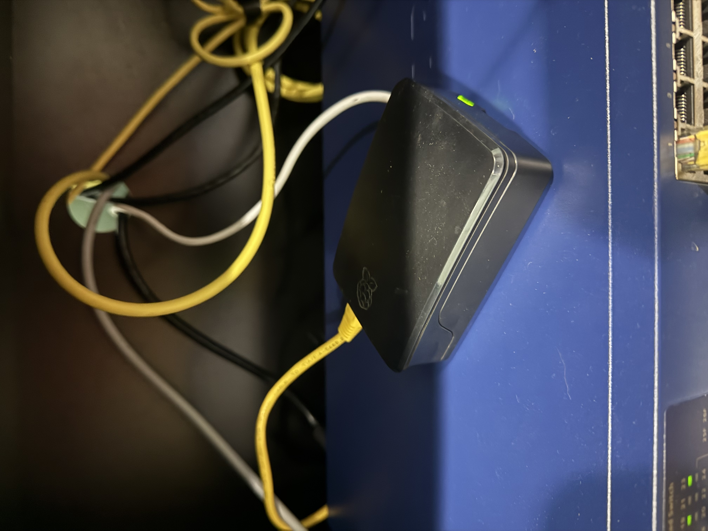
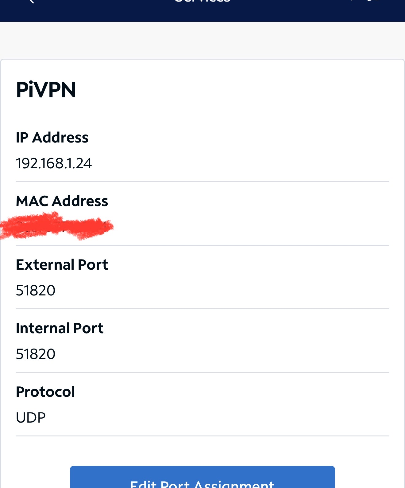

# Raspberry Pi WireGuard VPN

A hands-on home VPN project using Raspberry Pi OS Lite and WireGuard/PiVPN to provide secure remote access to a private network.
The project demonstrates practical experience with Linux-based networking, SSH, VPN configuration, DNS, router port forwarding, client provisioning, and VPN troubleshooting.

## Project Overview

The VPN server was built on a Raspberry Pi running Raspberry Pi OS Lite 32-bit.
PiVPN was used to deploy and manage WireGuard clients.
The completed setup allows authorized client devices to establish an encrypted VPN connection back to the home network.

## Project Evidence

The repository includes documentation and setup evidence covering:

- Raspberry Pi VPN server setup
- WireGuard/PiVPN configuration
- Router port forwarding
- iOS client provisioning
- Windows client configuration
- VPN troubleshooting
- Configuration backup

### Raspberry Pi VPN Server



### Router Port Forwarding



## Objectives

- Build a Raspberry Pi-based VPN server
- Configure WireGuard for secure remote access
- Enable SSH-based administration
- Configure DNS for the VPN environment
- Configure router port forwarding
- Create and manage WireGuard client profiles
- Connect mobile and Windows clients
- Practice VPN troubleshooting and backup procedures

## Technologies

- Raspberry Pi
- Raspberry Pi OS Lite
- PiVPN
- WireGuard
- SSH
- Cloudflare DNS
- UDP
- Router Port Forwarding
- WinSCP
- iOS WireGuard Client
- Windows WireGuard Client

## Network Overview

```text
                    Internet
                       |
                       |
                 Home Router
                       |
                       |
                Raspberry Pi
                WireGuard VPN
                       |
                 Home Network
```
